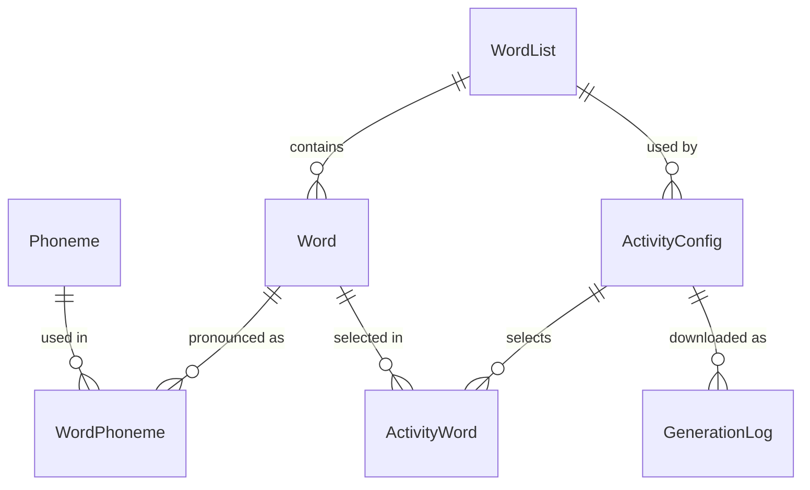

# Phoneme Builder (Assessment 2)

Phoneme Builder is a Next.js web application for creating phoneme-based classroom activities for Speech Pathology teaching. Assessment 1 built the frontend. Assessment 2 adds a backend and database so teachers can store phoneme word lists, save activity settings, and download Wordle and Word Search HTML files generated from the saved data.

**Author:** Ibrahim Khurram, Student Number 21561062

## Features

- **Word lists:** create, rename and delete lists; add, edit and delete words. Each word has an English match, its phonemes in order, and an optional clue.
- **Multi-character phonemes:** symbols such as `tʃ`, `dʒ`, `aɪ` and `iː` are stored as single units, never split into characters.
- **Saved activities:** Wordle and Word Search configurations (difficulty, hints, guesses, grid size, directions, title, author, file name, selected words) are stored in the database and can be reopened, edited or deleted.
- **Server-side generation:** `GET /api/activities/:id/generate` builds the downloadable HTML from the database, and every download is logged.
- **Validation and errors:** every request is validated with Zod and business rules, with clear messages shown next to the relevant form field.
- **Health check:** `GET /health` returns `200 OK` when the app and database are working.
- **Docker:** multi-stage Dockerfile, with the database stored in a volume.

## Tech stack

Next.js 16 (App Router, route handlers), React 19, Tailwind CSS 4, Prisma 6 ORM, SQLite, Zod 4, Docker (node:22-alpine).

## Run with Docker

```bash
docker compose up --build
```

Or without Compose:

```bash
docker build -t phoneme-builder .
docker run --init -p 3000:3000 -v phoneme-data:/app/data phoneme-builder
```

Open http://localhost:3000 and check http://localhost:3000/health.

On start the container applies the migrations (`prisma migrate deploy`), seeds the phoneme inventory, then starts Next.js. Starter word lists and two sample activities are added only when the database is new. Data persists in the `phoneme-data` volume. To start from an empty database, run `docker compose down -v`.

## Run locally

Requires Node.js 20 or later.

```bash
npm install
cp .env.example .env          # Windows: copy .env.example .env
npx prisma migrate dev        # creates prisma/dev.db and applies migrations
npm run db:seed               # phoneme inventory and starter content
npm run dev
```

Open http://localhost:3000.

| Script | Purpose |
| --- | --- |
| `npm run dev` | Development server |
| `npm run build` / `npm start` | Production build and server |
| `npm run db:migrate` | Create and apply a migration after changing the schema |
| `npm run db:seed` | Seed phonemes (safe to run again) |
| `npm run db:reset` | Drop, re-migrate and re-seed the local database |
| `npm run db:studio` | Browse the database in Prisma Studio |
| `npm run lint` | ESLint |

## Database design

Schema: `prisma/schema.prisma`. Migration: `prisma/migrations/`.



| Model | Purpose |
| --- | --- |
| `Phoneme` | IPA symbol (unique, may be several characters), plain-letter label, example word, consonant or vowel |
| `WordList` | Named group of words (unique name, optional description) |
| `Word` | English word (unique within its list) and optional clue |
| `WordPhoneme` | Ordered link from a word to its phonemes. The key `(wordId, position)` keeps the order, so "chair" is stored as `tʃ` then `eə` |
| `ActivityConfig` | Activity type (`WORDLE` or `WORD_SEARCH`), difficulty (`EASY`, `MEDIUM`, `HARD`), hints, Wordle guesses, Word Search grid size and directions, and output settings (title, author, file name) |
| `ActivityWord` | The words an activity uses, in order |
| `GenerationLog` | One row per HTML download (file name, word count, size, time) |

Deleting a word list removes its words and activities. Deleting a word removes it from any activity that used it. A phoneme cannot be deleted while a word uses it.

## API

All JSON responses use `{ "data": ... }` on success and `{ "error": { "code", "message", "details" } }` on failure.

| Method | Route | Description |
| --- | --- | --- |
| GET | `/health` (also `/api/health`) | App and database status, `200 OK` when healthy, `503` if the database is unreachable |
| GET | `/api/phonemes` | Phoneme inventory |
| POST | `/api/phonemes/parse` | Check phoneme text without saving: `{ "text": "tʃeə" }` |
| GET | `/api/word-lists` | All lists with word and activity counts |
| POST | `/api/word-lists` | Create: `{ "name", "description"? }` |
| GET | `/api/word-lists/:id` | One list with its words |
| PATCH / PUT | `/api/word-lists/:id` | Update name or description |
| DELETE | `/api/word-lists/:id` | Delete a list, its words and its activities |
| GET | `/api/word-lists/:id/words` | Words in a list |
| POST | `/api/word-lists/:id/words` | Add: `{ "english", "phonemes", "hint"? }` |
| GET | `/api/words/:id` | One word |
| PATCH / PUT | `/api/words/:id` | Update any of `english`, `phonemes`, `hint` |
| DELETE | `/api/words/:id` | Delete a word |
| GET | `/api/activities?type=&wordListId=` | Saved activities, optionally filtered |
| POST | `/api/activities` | Create an activity (see below) |
| GET | `/api/activities/:id` | One activity with its words |
| PUT | `/api/activities/:id` | Replace all settings |
| PATCH | `/api/activities/:id` | Change only the fields sent |
| DELETE | `/api/activities/:id` | Delete an activity (the word list is kept) |
| GET | `/api/activities/:id/generate` | Download the generated HTML (`?view=inline` opens it in the browser instead) |

The `phonemes` field accepts `"k æ t"`, `"kæt"`, `"/kæt/"` or `["k", "æ", "t"]`. Unspaced text is split using the longest matching symbol, so `tʃ` stays one phoneme, while `t ʃ` with a space is two. An ASCII colon is read as the IPA length mark (`i:` becomes `iː`).

Example activity:

```json
{
  "name": "Week 3 TH sounds",
  "type": "WORD_SEARCH",
  "difficulty": "MEDIUM",
  "showHints": true,
  "gridSize": 10,
  "allowDiagonal": true,
  "allowBackwards": false,
  "title": "TH Word Search",
  "authorName": "Ibrahim Khurram",
  "authorNumber": "21561062",
  "fileName": "th-word-search",
  "wordListId": 1,
  "wordIds": [1, 2, 3]
}
```

Wordle activities send `maxGuesses` (1 to 10) instead of the grid settings.

### Try it with curl

```bash
curl -i http://localhost:3000/health
curl -X POST http://localhost:3000/api/word-lists -H "Content-Type: application/json" -d '{"name":"S blends"}'
curl -X POST http://localhost:3000/api/word-lists/3/words -H "Content-Type: application/json" -d '{"english":"star","phonemes":"s t ɑː"}'
curl -X PATCH http://localhost:3000/api/words/13 -H "Content-Type: application/json" -d '{"hint":"It shines at night"}'
curl -X DELETE http://localhost:3000/api/words/13
```

## Validation rules

| Rule | Status |
| --- | --- |
| Body is missing or not valid JSON | 400 |
| Id in the URL is not a positive whole number | 400 |
| Required fields missing or too long (list name 80, English word 40, clue 120, title 80 characters) | 400 |
| English word uses characters other than letters, spaces, hyphens and apostrophes | 400 |
| Phoneme text is empty, has an unknown symbol (with suggestions), or has more than 12 phonemes | 400 |
| Wordle without `maxGuesses`, Word Search without `gridSize`, grid size outside 8 to 15, no words selected | 400 |
| Duplicate list name, or duplicate English word within a list | 409 |
| Record not found | 404 |
| Selected word belongs to another list or does not exist | 422 |
| Wordle word without 2 to 8 phonemes | 422 |
| Word Search word longer than the grid, or two words with the same letters | 422 |
| Downloading an activity that has no words left | 422 |

## Project structure

```text
app/
  page.js, about/, settings/        Assessment 1 pages
  wordle/page.js                    Wordle builder (loads and saves via the API)
  wordsearch/page.js                Word Search builder (loads and saves via the API)
  word-lists/page.js                Word list and word management
  activities/page.js                Saved activities library
  health/route.js                   GET /health
  api/                              Route handlers (thin, call the services)
components/                         UI components (previews, word picker, form controls)
hooks/useActivityBuilder.js         Shared builder state and API calls
lib/
  services/                         Database logic for phonemes, lists, words, activities, generation
  validation/schemas.js             Zod schemas
  server/                           Prisma client, error classes, response helpers
  phonemeParser.js                  Phoneme text parsing (shared by browser and server)
  generateWordleHtml.js             Standalone Wordle HTML
  generateWordSearchHtml.js         Standalone Word Search HTML
  wordSearchGrid.js, phonemes.js, difficulty.js, apiClient.js, html.js, download.js
prisma/
  schema.prisma, migrations/, seed.js
Dockerfile, docker-compose.yml, .dockerignore
```

## References

International Phonetic Association. (n.d.). *The International Phonetic Alphabet and the IPA chart*. Retrieved August 12, 2026, from https://www.internationalphoneticassociation.org/content/full-ipa-chart/ipa-vowels

MDN Web Docs. (n.d.). *Document: Cookie property*. Retrieved August 12, 2026, from https://developer.mozilla.org/en-US/docs/Web/API/Document/cookie

MDN Web Docs. (n.d.). *Responsive web design*. Retrieved August 12, 2026, from https://developer.mozilla.org/en-US/docs/Learn_web_development/Core/CSS_layout/Responsive_Design

Nielsen, J. (1994, April 24). *10 usability heuristics for user interface design*. Nielsen Norman Group. https://www.nngroup.com/articles/ten-usability-heuristics/

React. (n.d.). *Your first component*. Retrieved August 12, 2026, from https://react.dev/learn/your-first-component

Vercel. (n.d.). *Installation*. Next.js. Retrieved August 12, 2026, from https://nextjs.org/docs/app/getting-started/installation

Vercel. (n.d.). *Route handlers*. Next.js. Retrieved September 16, 2026, from https://nextjs.org/docs/app/getting-started/route-handlers

Vercel. (n.d.). *Deploying: Docker*. Next.js. Retrieved September 16, 2026, from https://nextjs.org/docs/app/getting-started/deploying

Prisma. (n.d.). *Prisma ORM documentation*. Retrieved September 16, 2026, from https://www.prisma.io/docs/orm

Zod. (n.d.). *Zod documentation*. Retrieved September 16, 2026, from https://zod.dev

Docker. (n.d.). *Dockerfile reference*. Retrieved September 16, 2026, from https://docs.docker.com/reference/dockerfile/

World Wide Web Consortium. (2024, December 12). *Web Content Accessibility Guidelines (WCAG) 2.2*. https://www.w3.org/TR/WCAG22/
